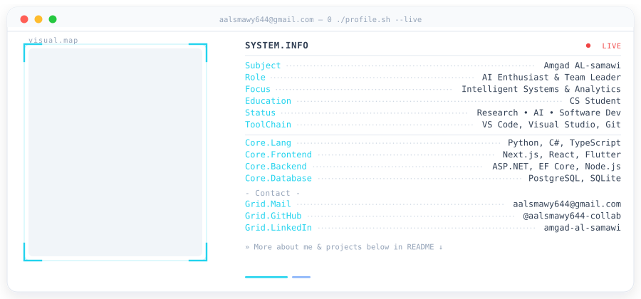

  

<h1 align="center">Full-Stack &amp; Deep Learning Developer</h1>

  
  
  

---

### About

CS student building intelligent systems — Python and C# on the back end, Next.js and Flutter on the front, with a focus on analytics and applied deep learning.

**Stack:** Python · C# · TypeScript · Next.js · React · Flutter · ASP.NET · EF Core · Node.js · PostgreSQL · SQLite

---

### Stats

  

  
  

---

### Projects

<!-- استبدل REPO_NAME باسم مستودعك لعرض بطاقة مشروع -->
<!--

-->
